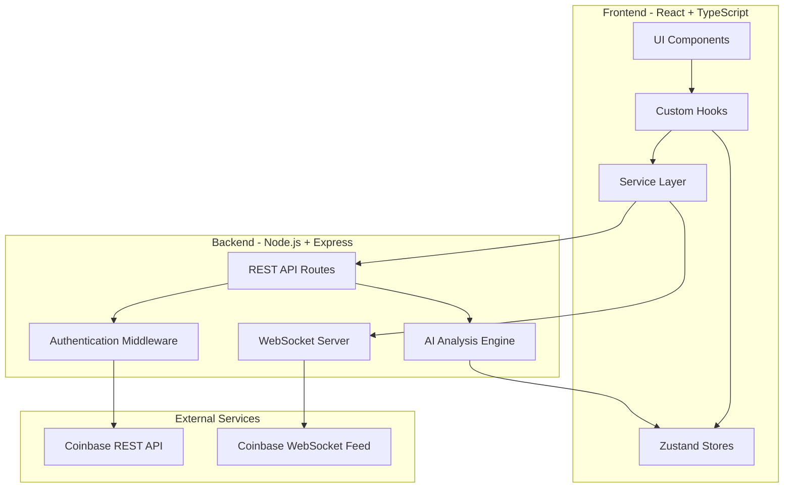

# Design Document

## Overview

Spectra is architected as a modern full-stack application with a React TypeScript frontend, Node.js backend, and real-time WebSocket communication. The system follows a layered architecture pattern with clear separation between presentation, business logic, and data access layers. The frontend uses Zustand for state management and implements a component-based architecture for modularity. The backend serves as an API gateway and WebSocket proxy, handling authentication, rate limiting, and AI calculations. Real-time market data flows from Coinbase WebSocket feeds through the backend to the frontend, while REST API calls handle trading operations and historical data retrieval.

## Architecture

### System Architecture Diagram



### Technology Stack Rationale

**Frontend:**

- **React 18+**: Provides concurrent rendering for smooth UI updates during high-frequency market data streams
- **TypeScript**: Ensures type safety across complex data structures (market data, orders, portfolio)
- **Zustand**: Lightweight state management (3KB) with minimal boilerplate, ideal for real-time data updates
- **TailwindCSS**: Utility-first CSS for rapid UI development and consistent design system
- **Recharts**: Declarative charting library with good performance for financial data visualization
- **Framer Motion**: Hardware-accelerated animations for smooth price transitions and UI interactions

**Backend:**

- **Node.js + Express**: Non-blocking I/O ideal for handling multiple WebSocket connections and API requests
- **WebSocket (ws library)**: Native WebSocket support for bidirectional real-time communication
- **Crypto module**: Built-in HMAC SHA256 signing for Coinbase API authentication

**Deployment:**

- **Vercel**: Edge network deployment for frontend with automatic HTTPS and CDN
- **Railway**: Container-based backend hosting with native WebSocket support and auto-scaling

### Data Flow Architecture

**Real-Time Market Data Flow:**

1. Coinbase WebSocket Feed → Backend WebSocket Manager
2. Backend normalizes and batches messages (60fps throttling)
3. Backend broadcasts to connected frontend clients via WebSocket
4. Frontend updates Zustand market store
5. React components re-render with new prices (memoized to prevent unnecessary renders)

**Trading Operation Flow:**

1. User submits order via Trading Interface
2. Frontend validates inputs and shows confirmation modal
3. Frontend sends order to Backend REST API
4. Backend authenticates request with HMAC signature
5. Backend submits order to Coinbase REST API
6. Backend returns order status to frontend
7. Frontend updates Portfolio Store and displays confirmation

**AI Insights Flow:**

1. Backend AI Engine subscribes to market data updates
2. On price updates, AI Engine calculates technical indicators (RSI, SMA, volatility)
3. AI Engine generates insights and caches for 60 seconds
4. Frontend polls insights endpoint every 30 seconds
5. Kiro Agent Hook triggers recalculation on significant market moves (>5% in 15 min)
6. Frontend displays updated insights in dashboard

## Components and Interfaces

### Frontend Component Hierarchy

```
App
├── Layout
│   ├── Header (navigation, theme toggle, connection status)
│   └── Sidebar (watchlist, quick actions)
├── HeatmapView
│   ├── ViewModeSelector (24h change, volume, volatility, market cap)
│   ├── HeatmapGrid
│   │   └── CoinCell[] (individual cryptocurrency cells)
│   └── CoinDetailModal (detailed view on click)
├── TradingView
│   ├── OrderForm (buy/sell form with validation)
│   ├── OrderBook (live bids/asks)
│   ├── OrderConfirmation (confirmation modal)
│   └── PriceChart (candlestick/line chart)
├── PortfolioView
│   ├── PortfolioSummary (total value, 24h P&L)
│   ├── HoldingsList (individual holdings table)
│   ├── AllocationChart (pie chart)
│   └── PortfolioChart (historical value line chart)
├── InsightsView
│   ├── InsightsDashboard
│   │   └── InsightCard[] (3-5 prioritized insights)
│   └── MetricsDisplay (RSI, volatility, volume indicators)
├── AlertsView
│   ├── AlertsList (active alerts)
│   ├── CreateAlert (alert creation form)
│   └── AlertNotification (toast notifications)
└── TradeHistoryView
    ├── TradeHistoryTable (paginated table)
    ├── TradeFilters (filter controls)
    └── ExportButton (CSV export)
```

### Key Component Interfaces

**CoinCell Component:**

```typescript
interface CoinCellProps {
  symbol: string
  name: string
  price: number
  change24h: number
  volume24h: number
  marketCap: number
  viewMode: 'change' | 'volume' | 'volatility' | 'marketCap'
  onClick: (symbol: string) => void
}
```

**OrderForm Component:**

```typescript
interface OrderFormProps {
  symbol: string
  currentPrice: number
  balance: number
  onSubmit: (order: OrderRequest) => Promise<void>
  onCancel: () => void
}

interface OrderRequest {
  symbol: string
  side: 'buy' | 'sell'
  type: 'market' | 'limit'
  amount: number
  limitPrice?: number
}
```

**InsightCard Component:**

```typescript
interface InsightCardProps {
  insight: MarketInsight
  onClick: (insight: MarketInsight) => void
}

interface MarketInsight {
  id: string
  symbol: string
  signal: 'bullish' | 'bearish' | 'neutral'
  confidence: number // 0-100
  summary: string
  indicators: {
    rsi?: number
    volumeChange?: number
    volatility?: number
    smaSignal?: 'golden_cross' | 'death_cross' | null
  }
  timestamp: number
}
```

### Backend Service Interfaces

**WebSocket Manager:**

```typescript
interface WebSocketManager {
  connect(): Promise<void>
  disconnect(): void
  subscribe(productIds: string[]): void
  onMessage(handler: (message: TickerMessage) => void): void
  getConnectionStatus(): 'connected' | 'disconnected' | 'reconnecting'
}

interface TickerMessage {
  type: 'ticker'
  productId: string
  price: number
  open24h: number
  volume24h: number
  low24h: number
  high24h: number
  bestBid: number
  bestAsk: number
  timestamp: number
}
```

**AI Engine:**

```typescript
interface AIEngine {
  calculateRSI(prices: number[], period?: number): number
  calculateVolatility(prices: number[]): number
  detectSMACrossover(prices: number[]): 'bullish' | 'bearish' | 'neutral'
  analyzeVolume(current: number, average: number): VolumeAnalysis
  generateInsights(marketData: MarketData[]): MarketInsight[]
}

interface VolumeAnalysis {
  change: number // percentage
  isSignificant: boolean // >150% of average
  trend: 'increasing' | 'decreasing' | 'stable'
}
```

**Coinbase API Client:**

```typescript
interface CoinbaseClient {
  authenticate(apiKey: string, apiSecret: string): void
  getAccounts(): Promise<Account[]>
  placeOrder(order: OrderRequest): Promise<OrderResponse>
  getOrder(orderId: string): Promise<Order>
  cancelOrder(orderId: string): Promise<void>
  getProducts(): Promise<Product[]>
}

interface OrderResponse {
  orderId: string
  status: 'pending' | 'open' | 'filled' | 'cancelled'
  filledSize: number
  executedValue: number
  fees: number
}
```

## Data Models

### Market Data Models

**Cryptocurrency:**

```typescript
interface Cryptocurrency {
  symbol: string // e.g., 'BTC'
  name: string // e.g., 'Bitcoin'
  productId: string // e.g., 'BTC-USD'
  price: number
  change24h: number // percentage
  volume24h: number
  marketCap: number
  high24h: number
  low24h: number
  lastUpdate: number // timestamp
}
```

**PriceHistory:**

```typescript
interface PriceHistory {
  symbol: string
  interval: '1m' | '5m' | '15m' | '1h' | '1d'
  candles: Candle[]
}

interface Candle {
  timestamp: number
  open: number
  high: number
  low: number
  close: number
  volume: number
}
```

### Portfolio Models

**Portfolio:**

```typescript
interface Portfolio {
  userId: string
  totalValue: number // USD
  cash: number // available USD
  holdings: Holding[]
  change24h: number // USD
  change24hPercent: number
  lastUpdate: number
}

interface Holding {
  symbol: string
  quantity: number
  averageBuyPrice: number
  currentPrice: number
  currentValue: number
  unrealizedPnL: number
  unrealizedPnLPercent: number
}
```

### Trading Models

**Order:**

```typescript
interface Order {
  orderId: string
  userId: string
  symbol: string
  side: 'buy' | 'sell'
  type: 'market' | 'limit'
  status: 'pending' | 'open' | 'filled' | 'cancelled' | 'rejected'
  amount: number
  limitPrice?: number
  filledAmount: number
  averagePrice: number
  fees: number
  totalValue: number
  createdAt: number
  updatedAt: number
}
```

**Trade:**

```typescript
interface Trade {
  tradeId: string
  orderId: string
  userId: string
  symbol: string
  side: 'buy' | 'sell'
  amount: number
  price: number
  fees: number
  totalValue: number
  executedAt: number
}
```

### Alert Models

**Alert:**

```typescript
interface Alert {
  alertId: string
  userId: string
  symbol: string
  type: 'price' | 'rsi' | 'volume' | 'sma_crossover' | 'volatility'
  condition: AlertCondition
  status: 'active' | 'triggered' | 'snoozed' | 'dismissed'
  createdAt: number
  triggeredAt?: number
}

interface AlertCondition {
  // For price alerts
  priceAbove?: number
  priceBelow?: number

  // For RSI alerts
  rsiAbove?: number
  rsiBelow?: number

  // For volume alerts
  volumeChangePercent?: number

  // For SMA alerts
  smaCrossover?: 'golden' | 'death'

  // For volatility alerts
  volatilityThreshold?: number
}
```

## Error Handling

### Error Classification

**Network Errors:**

- WebSocket connection failures
- API request timeouts
- Rate limit exceeded
- DNS resolution failures

**Authentication Errors:**

- Invalid API credentials
- Expired signatures
- Insufficient permissions

**Validation Errors:**

- Invalid order amounts
- Insufficient balance
- Below minimum order size
- Invalid price limits

**Business Logic Errors:**

- Market closed
- Trading pair not available
- Order already filled/cancelled

### Error Handling Strategy

**Frontend Error Handling:**

```typescript
interface ErrorHandler {
  handleNetworkError(error: NetworkError): void
  handleValidationError(error: ValidationError): void
  handleAuthError(error: AuthError): void
  displayUserMessage(message: string, severity: 'error' | 'warning' | 'info'): void
}

// Example implementation
class FrontendErrorHandler implements ErrorHandler {
  handleNetworkError(error: NetworkError): void {
    if (error.code === 'TIMEOUT') {
      this.displayUserMessage('Request timed out. Please try again.', 'error')
    } else if (error.code === 'CONNECTION_LOST') {
      this.displayUserMessage('Connection lost. Reconnecting...', 'warning')
      // Trigger reconnection logic
    }
  }

  handleValidationError(error: ValidationError): void {
    // Display field-specific error messages
    this.displayUserMessage(error.message, 'error')
  }
}
```

**Backend Error Handling:**

```typescript
// Express error middleware
app.use((err: Error, req: Request, res: Response, next: NextFunction) => {
  logger.error('Error occurred', {
    error: err.message,
    stack: err.stack,
    path: req.path,
    method: req.method,
  })

  if (err instanceof ValidationError) {
    return res.status(400).json({
      error: 'Validation failed',
      details: err.details,
    })
  }

  if (err instanceof AuthenticationError) {
    return res.status(401).json({
      error: 'Authentication failed',
      message: 'Invalid credentials',
    })
  }

  if (err instanceof RateLimitError) {
    return res.status(429).json({
      error: 'Rate limit exceeded',
      retryAfter: err.retryAfter,
    })
  }

  // Generic error response
  res.status(500).json({
    error: 'Internal server error',
    message: 'An unexpected error occurred',
  })
})
```

**WebSocket Error Handling:**

```typescript
class WebSocketManager {
  private reconnectAttempts = 0
  private maxReconnectAttempts = 10
  private baseDelay = 1000 // 1 second

  private handleConnectionError(error: Error): void {
    logger.error('WebSocket connection error', { error: error.message })
    this.attemptReconnect()
  }

  private attemptReconnect(): void {
    if (this.reconnectAttempts >= this.maxReconnectAttempts) {
      logger.error('Max reconnection attempts reached')
      this.notifyFrontend('connection_failed')
      return
    }

    const delay = Math.min(
      this.baseDelay * Math.pow(2, this.reconnectAttempts),
      60000 // Max 60 seconds
    )

    setTimeout(() => {
      this.reconnectAttempts++
      this.connect()
    }, delay)
  }
}
```

### Retry Logic

**API Request Retry:**

- Retry on network errors: 3 attempts with exponential backoff
- Retry on 5xx server errors: 2 attempts with 1-second delay
- No retry on 4xx client errors (validation, authentication)
- No retry on successful responses (2xx)

**WebSocket Reconnection:**

- Exponential backoff: 1s, 2s, 4s, 8s, 16s, 32s, 60s (max)
- Maximum 10 reconnection attempts
- Reset attempt counter on successful connection
- Resubscribe to channels after reconnection

## Testing Strategy

### Unit Testing

**Frontend Unit Tests:**

- Component rendering tests (React Testing Library)
- Hook behavior tests (custom hooks)
- Utility function tests (calculations, formatters, validators)
- Store action tests (Zustand stores)

**Backend Unit Tests:**

- AI calculation tests (RSI, SMA, volatility)
- Authentication signature generation tests
- Data normalization tests
- Validation logic tests

**Example Test Cases:**

```typescript
// RSI calculation test
describe('calculateRSI', () => {
  it('should return 50 with insufficient data', () => {
    expect(calculateRSI([100])).toBe(50)
  })

  it('should calculate RSI correctly for standard dataset', () => {
    const prices = [
      44, 44.34, 44.09, 43.61, 44.33, 44.83, 45.1, 45.42, 45.84, 46.08, 45.89, 46.03, 45.61, 46.28,
      46.28,
    ]
    expect(calculateRSI(prices, 14)).toBeCloseTo(66.25, 1)
  })

  it('should identify overbought conditions', () => {
    const overboughtPrices = generateOverboughtPrices()
    expect(calculateRSI(overboughtPrices)).toBeGreaterThan(70)
  })
})

// Order validation test
describe('validateOrderAmount', () => {
  it('should reject negative amounts', () => {
    const result = validateOrderAmount(-10, 1000)
    expect(result.valid).toBe(false)
    expect(result.error).toBe('Amount must be positive')
  })

  it('should reject amounts below minimum', () => {
    const result = validateOrderAmount(5, 1000)
    expect(result.valid).toBe(false)
    expect(result.error).toContain('Minimum order')
  })

  it('should reject amounts exceeding balance', () => {
    const result = validateOrderAmount(1500, 1000)
    expect(result.valid).toBe(false)
    expect(result.error).toBe('Insufficient balance')
  })
})
```

### Integration Testing

**API Integration Tests:**

- Test complete order placement flow (frontend → backend → Coinbase)
- Test WebSocket message flow (Coinbase → backend → frontend)
- Test authentication flow with real API credentials (sandbox)
- Test error handling for various failure scenarios

**Database Integration Tests:**

- Test portfolio persistence and retrieval
- Test trade history storage and querying
- Test alert creation and triggering

### End-to-End Testing

**Critical User Flows:**

1. **Market Monitoring Flow:**
   - User opens dashboard
   - Heatmap loads with real-time data
   - Prices update in real-time
   - User switches view modes
   - User clicks on cryptocurrency for details

2. **Trading Flow:**
   - User selects cryptocurrency
   - User enters order details
   - System validates inputs
   - User confirms order
   - Order executes successfully
   - Portfolio updates with new holding

3. **Alert Flow:**
   - User creates price alert
   - Market price crosses threshold
   - Alert triggers
   - User receives notification
   - User dismisses alert

**E2E Test Framework:**

- Use Playwright for browser automation
- Test on Chrome, Firefox, Safari
- Test on desktop and mobile viewports
- Mock Coinbase API responses for consistent testing

### Performance Testing

**Load Testing:**

- Simulate 100 concurrent WebSocket connections
- Measure message processing latency
- Test frontend rendering performance with 30 simultaneous price updates
- Measure API response times under load

**Stress Testing:**

- Test system behavior during extreme market volatility (1000+ updates/second)
- Test memory usage over extended periods (24+ hours)
- Test database query performance with large datasets (10,000+ trades)

**Performance Benchmarks:**

- WebSocket message latency: < 100ms
- API response time: < 500ms (p95)
- Frontend frame rate: > 30fps during updates
- Time to interactive: < 3 seconds on 4G connection

### Testing Tools

- **Frontend:** Jest, React Testing Library, Vitest
- **Backend:** Jest, Supertest
- **E2E:** Playwright
- **Load Testing:** Artillery, k6
- **Code Coverage:** Istanbul/nyc (target: 80% coverage)

## Performance Optimizations

### Frontend Optimizations

**React Rendering Optimizations:**

```typescript
// Memoize expensive components
const CoinCell = React.memo(
  ({ symbol, price, change24h }: CoinCellProps) => {
    // Component implementation
  },
  (prevProps, nextProps) => {
    // Only re-render if price or change24h changed
    return prevProps.price === nextProps.price && prevProps.change24h === nextProps.change24h
  }
)

// Use useMemo for expensive calculations
const sortedCoins = useMemo(() => {
  return coins.sort((a, b) => b.change24h - a.change24h)
}, [coins])

// Use useCallback for event handlers
const handleCoinClick = useCallback((symbol: string) => {
  setSelectedCoin(symbol)
}, [])
```

**WebSocket Update Batching:**

```typescript
class MarketDataBatcher {
  private updateQueue: MarketUpdate[] = []
  private rafId: number | null = null

  queueUpdate(update: MarketUpdate): void {
    this.updateQueue.push(update)

    if (!this.rafId) {
      this.rafId = requestAnimationFrame(() => {
        this.flushUpdates()
      })
    }
  }

  private flushUpdates(): void {
    const batch = [...this.updateQueue]
    this.updateQueue = []
    this.rafId = null

    // Process all updates at once
    marketStore.updateBatch(batch)
  }
}
```

**Virtual Scrolling:**

```typescript
import { FixedSizeList } from 'react-window';

function TradeHistory({ trades }: { trades: Trade[] }) {
  return (
    <FixedSizeList
      height={600}
      itemCount={trades.length}
      itemSize={60}
      width="100%"
    >
      {({ index, style }) => (
        <TradeRow trade={trades[index]} style={style} />
      )}
    </FixedSizeList>
  );
}
```

### Backend Optimizations

**Caching Strategy:**

```typescript
class InsightsCache {
  private cache = new Map<string, CachedInsight>()
  private ttl = 60000 // 60 seconds

  get(symbol: string): MarketInsight[] | null {
    const cached = this.cache.get(symbol)
    if (!cached) return null

    const now = Date.now()
    if (now - cached.timestamp > this.ttl) {
      this.cache.delete(symbol)
      return null
    }

    return cached.insights
  }

  set(symbol: string, insights: MarketInsight[]): void {
    this.cache.set(symbol, {
      insights,
      timestamp: Date.now(),
    })
  }
}
```

**Connection Pooling:**

```typescript
// Reuse HTTP connections for Coinbase API
const axios = require('axios')
const https = require('https')

const httpsAgent = new https.Agent({
  keepAlive: true,
  maxSockets: 50,
  maxFreeSockets: 10,
  timeout: 60000,
})

const apiClient = axios.create({
  httpsAgent,
  timeout: 10000,
})
```

**Rate Limiting:**

```typescript
import rateLimit from 'express-rate-limit'

const apiLimiter = rateLimit({
  windowMs: 15 * 60 * 1000, // 15 minutes
  max: 100, // 100 requests per window
  standardHeaders: true,
  legacyHeaders: false,
  handler: (req, res) => {
    res.status(429).json({
      error: 'Too many requests',
      retryAfter: req.rateLimit.resetTime,
    })
  },
})

app.use('/api/', apiLimiter)
```

### Database Optimizations

**Indexing Strategy:**

- Index on `userId` for portfolio and trade queries
- Index on `symbol` for market data queries
- Composite index on `(userId, createdAt)` for trade history
- Index on `(userId, status)` for active alerts

**Query Optimization:**

- Use pagination for large result sets (trade history)
- Implement cursor-based pagination for real-time data
- Use projection to fetch only required fields
- Batch database writes for trade history

## Security Considerations

### API Key Management

**Environment Variables:**

```bash
# Never commit these to version control
COINBASE_API_KEY=your_api_key
COINBASE_API_SECRET=your_api_secret
JWT_SECRET=your_jwt_secret
```

**Key Rotation:**

- Rotate API keys every 90 days
- Use separate keys for development, staging, production
- Implement key versioning for zero-downtime rotation

### Authentication Flow

**HMAC Signature Generation:**

```typescript
function generateSignature(
  timestamp: number,
  method: string,
  path: string,
  body: string,
  secret: string
): string {
  const message = `${timestamp}${method}${path}${body}`
  return crypto.createHmac('sha256', secret).update(message).digest('hex')
}

// Usage
const timestamp = Math.floor(Date.now() / 1000)
const signature = generateSignature(
  timestamp,
  'POST',
  '/api/v3/brokerage/orders',
  JSON.stringify(orderData),
  process.env.COINBASE_API_SECRET
)
```

### Input Validation

**Server-Side Validation:**

```typescript
import Joi from 'joi'

const orderSchema = Joi.object({
  symbol: Joi.string()
    .pattern(/^[A-Z]+-USD$/)
    .required(),
  side: Joi.string().valid('buy', 'sell').required(),
  type: Joi.string().valid('market', 'limit').required(),
  amount: Joi.number().positive().min(10).required(),
  limitPrice: Joi.number().positive().when('type', {
    is: 'limit',
    then: Joi.required(),
  }),
})

function validateOrder(data: unknown): OrderRequest {
  const { error, value } = orderSchema.validate(data)
  if (error) {
    throw new ValidationError(error.details[0].message)
  }
  return value
}
```

### CORS Configuration

```typescript
import cors from 'cors'

const corsOptions = {
  origin: process.env.FRONTEND_URL || 'http://localhost:5173',
  credentials: true,
  optionsSuccessStatus: 200,
}

app.use(cors(corsOptions))
```

### Rate Limiting

- API endpoints: 100 requests per 15 minutes per IP
- WebSocket connections: 5 connections per IP
- Order placement: 10 orders per minute per user
- Alert creation: 20 alerts per hour per user

## Deployment Architecture

### Frontend Deployment (Vercel)

**Build Configuration:**

```json
{
  "buildCommand": "cd frontend && npm run build",
  "outputDirectory": "frontend/dist",
  "installCommand": "cd frontend && npm install",
  "framework": "vite"
}
```

**Environment Variables:**

- `VITE_BACKEND_API_URL`: Backend API URL
- `VITE_BACKEND_WS_URL`: Backend WebSocket URL
- `VITE_ENABLE_PAPER_TRADING`: Feature flag

### Backend Deployment (Railway)

**Dockerfile:**

```dockerfile
FROM node:18-alpine
WORKDIR /app
COPY backend/package*.json ./
RUN npm ci --only=production
COPY backend/src ./src
COPY backend/tsconfig.json ./
RUN npm run build
EXPOSE 3001 3002
CMD ["npm", "start"]
```

**Environment Variables:**

- `COINBASE_API_KEY`: Coinbase API key
- `COINBASE_API_SECRET`: Coinbase API secret
- `NODE_ENV`: production
- `PORT`: 3001
- `WS_PORT`: 3002
- `FRONTEND_URL`: Frontend URL for CORS

### Monitoring and Logging

**Logging Strategy:**

```typescript
import winston from 'winston'

const logger = winston.createLogger({
  level: process.env.LOG_LEVEL || 'info',
  format: winston.format.json(),
  transports: [
    new winston.transports.File({ filename: 'error.log', level: 'error' }),
    new winston.transports.File({ filename: 'combined.log' }),
  ],
})

// Log important events
logger.info('Order placed', { userId, orderId, symbol, amount })
logger.error('API request failed', { error, endpoint, statusCode })
```

**Health Checks:**

```typescript
app.get('/health', (req, res) => {
  const health = {
    uptime: process.uptime(),
    timestamp: Date.now(),
    status: 'ok',
    services: {
      database: checkDatabaseConnection(),
      coinbaseAPI: checkCoinbaseConnection(),
      websocket: checkWebSocketStatus(),
    },
  }

  const isHealthy = Object.values(health.services).every((s) => s === 'ok')
  res.status(isHealthy ? 200 : 503).json(health)
})
```

## Design Decisions and Rationales

### Why Zustand over Redux?

- **Simplicity**: Minimal boilerplate, no actions/reducers/dispatchers
- **Performance**: Direct state updates without middleware overhead
- **Size**: 3KB vs 45KB (Redux + React-Redux)
- **TypeScript**: Better type inference out of the box
- **Real-time**: Easier to integrate with WebSocket updates

### Why Recharts over D3.js?

- **Learning Curve**: Declarative API vs imperative D3
- **React Integration**: Built for React, no DOM manipulation conflicts
- **Development Speed**: Pre-built chart components for financial data
- **Maintenance**: Less custom code to maintain
- **Note**: D3.js remains an option for custom heatmap visualization if needed

### Why Node.js Backend vs Serverless?

- **WebSocket Support**: Native WebSocket server support
- **Stateful Connections**: Maintain persistent Coinbase WebSocket connection
- **Cost**: More predictable pricing for high-frequency updates
- **Latency**: Lower latency for real-time data streaming

### Why Separate Backend vs Direct Frontend-to-Coinbase?

- **Security**: API keys never exposed to client
- **Rate Limiting**: Centralized rate limit management
- **Caching**: Server-side caching of AI insights
- **WebSocket Proxy**: Single Coinbase connection shared across clients
- **Business Logic**: Centralized order validation and risk management

### Why Paper Trading Mode?

- **User Onboarding**: Reduces barrier to entry for new traders
- **Risk Management**: Users can test strategies without financial risk
- **Demo Purposes**: Allows full feature demonstration without real funds
- **Development**: Easier testing without real money transactions

This design provides a solid foundation for building a production-ready cryptocurrency trading dashboard with real-time capabilities, AI-powered insights, and robust error handling.
