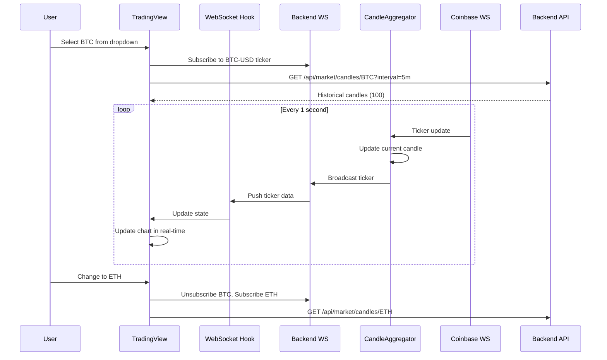
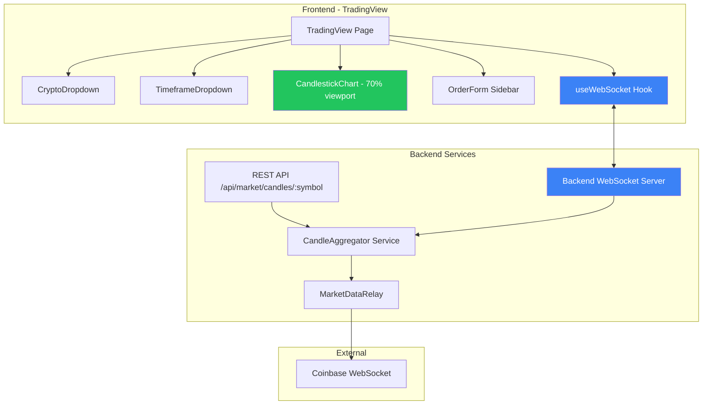

# Design Document

## Overview

This design transforms the TradingView page into a professional-grade trading interface with a chart-centric layout similar to TradingView.com. The candlestick chart occupies most of the viewport, with cryptocurrency and timeframe selection via compact dropdowns. Real-time updates are delivered via WebSocket every second, eliminating polling delays and ensuring traders see live price action.

## Architecture

### Data Flow Architecture



### System Components



## Components and Interfaces

### Frontend Components

#### TradingView Page Layout

```typescript
// New chart-centric layout structure
<div className="h-screen flex flex-col">
  {/* Header with dropdowns - compact */}
  <div className="h-16 flex items-center px-4 border-b">
    <CryptoDropdown />
    <TimeframeDropdown />
    <PriceDisplay />
  </div>
  
  {/* Main content - chart takes most space */}
  <div className="flex-1 flex">
    {/* Chart area - 75% width on desktop */}
    <div className="flex-1 min-w-0">
      <CandlestickChart height="100%" />
    </div>
    
    {/* Order form sidebar - 25% width, max 320px */}
    <div className="w-80 border-l hidden lg:block">
      <OrderForm />
    </div>
  </div>
</div>
```

#### CryptoDropdown Component

```typescript
interface CryptoDropdownProps {
  selectedSymbol: string
  onSelect: (symbol: string) => void
  cryptocurrencies: Cryptocurrency[]
}

// Dropdown option display
interface DropdownOption {
  symbol: string      // "BTC"
  name: string        // "Bitcoin"
  price: number       // 97150.25
  change24h: number   // 1.30 (percentage)
}

// Features:
// - Search/filter by symbol or name
// - Keyboard navigation (arrow keys, enter, escape)
// - Shows current price and 24h change in options
// - Selected item shows symbol + price prominently
```

**Visual Design:**
```
┌─────────────────────────────────┐
│ 🔽 BTC  $97,150.25  +1.30%     │  <- Selected state
└─────────────────────────────────┘
         │
         ▼
┌─────────────────────────────────┐
│ 🔍 Search...                    │
├─────────────────────────────────┤
│ BTC  Bitcoin     $97,150 +1.3% │
│ ETH  Ethereum    $2,796  -1.5% │
│ SOL  Solana      $185    +2.1% │
│ ...                             │
└─────────────────────────────────┘
```

#### TimeframeDropdown Component

```typescript
interface TimeframeDropdownProps {
  selectedInterval: string
  onSelect: (interval: string) => void
}

// Supported intervals grouped by category
const TIMEFRAME_OPTIONS = {
  minutes: [
    { value: '1m', label: '1m' },
    { value: '2m', label: '2m' },
    { value: '3m', label: '3m' },
    { value: '4m', label: '4m' },
    { value: '5m', label: '5m' },
    { value: '10m', label: '10m' },
    { value: '15m', label: '15m' },
    { value: '30m', label: '30m' },
    { value: '45m', label: '45m' },
  ],
  hours: [
    { value: '1h', label: '1H' },
    { value: '2h', label: '2H' },
    { value: '3h', label: '3H' },
    { value: '4h', label: '4H' },
  ],
  days: [
    { value: '1d', label: '1D' },
  ]
}
```

**Visual Design:**
```
┌──────────┐
│ 🔽 5m    │  <- Selected state
└──────────┘
     │
     ▼
┌──────────────────┐
│ Minutes          │
│  1m  2m  3m  4m  │
│  5m  10m 15m     │
│  30m 45m         │
├──────────────────┤
│ Hours            │
│  1H  2H  3H  4H  │
├──────────────────┤
│ Days             │
│  1D              │
└──────────────────┘
```

#### Enhanced CandlestickChart Component

```typescript
interface CandlestickChartProps {
  symbol: string
  interval: string
  candles: CandleData[]
  currentTicker: TickerData | null
  isLoading: boolean
  height?: string | number  // Default: "100%"
}

interface CandleData {
  timestamp: number
  open: number
  high: number
  low: number
  close: number
  volume: number
}

interface TickerData {
  price: number
  change24h: number
  change24hPercent: number
  volume24h: number
  high24h: number
  low24h: number
  timestamp: number
}
```

**Chart Structure (75% price, 25% volume):**
```
┌─────────────────────────────────────────────┐
│                                    $97,200  │
│  ┃   ┃                                      │
│  ┃   ┃  ┃                          $97,100  │
│  █   █  █   ┃                               │
│  █   █  █   █  ┃                   $97,000  │
│      █  █   █  █  ┃  ┃                      │
│         █   █  █  █  █  ┃          $96,900  │
│             █  █  █  █  █                   │
│ ─ ─ ─ ─ ─ ─ ─ ─ ─ ─ ─ ─ ─ [$96,850] ─ ─ ─ │ <- Current price line
│                 █  █  █  █         $96,800  │
├─────────────────────────────────────────────┤
│ ▄▄▄ ▄▄▄ ▄▄▄ ▄▄▄ ▄▄▄ ▄▄▄ ▄▄▄ ▄▄▄           │ <- Volume bars
│ 10:00  10:05  10:10  10:15  10:20          │
└─────────────────────────────────────────────┘
```

**Key Visual Features:**
1. **Proper Candlestick Rendering** - Correct wick and body positioning
2. **Current Price Line** - Dashed line with price badge
3. **Volume Bars** - Colored to match candle direction
4. **Professional Tooltip** - Shows OHLC + volume on hover
5. **Responsive Scaling** - Y-axis adjusts to visible price range

#### useInstrumentWebSocket Hook

```typescript
interface UseInstrumentWebSocketOptions {
  symbol: string
  enabled?: boolean
}

interface UseInstrumentWebSocketReturn {
  ticker: TickerData | null
  isConnected: boolean
  lastUpdate: number
}

function useInstrumentWebSocket(options: UseInstrumentWebSocketOptions): UseInstrumentWebSocketReturn
```

**Implementation:**
```typescript
function useInstrumentWebSocket({ symbol, enabled = true }: UseInstrumentWebSocketOptions) {
  const [ticker, setTicker] = useState<TickerData | null>(null)
  const { status, subscribe, unsubscribe } = useWebSocket()
  
  useEffect(() => {
    if (!enabled || !symbol) return
    
    // Subscribe to specific instrument
    const productId = `${symbol}-USD`
    subscribe(productId, (data: TickerData) => {
      setTicker(data)
    })
    
    return () => {
      unsubscribe(productId)
      setTicker(null)  // Clear data on symbol change
    }
  }, [symbol, enabled])
  
  return {
    ticker,
    isConnected: status === 'connected',
    lastUpdate: ticker?.timestamp || 0
  }
}
```

#### useCandleData Hook

```typescript
interface UseCandleDataOptions {
  symbol: string
  interval: string
  enabled?: boolean
}

interface UseCandleDataReturn {
  candles: CandleData[]
  isLoading: boolean
  error: string | null
  refetch: () => Promise<void>
}

function useCandleData(options: UseCandleDataOptions): UseCandleDataReturn
```

**Implementation with Request Cancellation:**
```typescript
function useCandleData({ symbol, interval, enabled = true }: UseCandleDataOptions) {
  const [candles, setCandles] = useState<CandleData[]>([])
  const [isLoading, setIsLoading] = useState(false)
  const [error, setError] = useState<string | null>(null)
  const abortControllerRef = useRef<AbortController | null>(null)
  
  const fetchCandles = useCallback(async () => {
    // Cancel any pending request
    if (abortControllerRef.current) {
      abortControllerRef.current.abort()
    }
    
    abortControllerRef.current = new AbortController()
    setIsLoading(true)
    setError(null)
    
    try {
      const response = await fetch(
        `/api/market/candles/${symbol}?interval=${interval}&limit=100`,
        { 
          credentials: 'include',
          signal: abortControllerRef.current.signal 
        }
      )
      
      if (!response.ok) throw new Error(`HTTP ${response.status}`)
      
      const data = await response.json()
      setCandles(data.candles)
    } catch (err) {
      if (err.name !== 'AbortError') {
        setError(err.message)
      }
    } finally {
      setIsLoading(false)
    }
  }, [symbol, interval])
  
  useEffect(() => {
    if (enabled) {
      fetchCandles()
    }
    
    return () => {
      abortControllerRef.current?.abort()
    }
  }, [symbol, interval, enabled, fetchCandles])
  
  return { candles, isLoading, error, refetch: fetchCandles }
}
```

### Backend Services

#### Extended CandleAggregator Service

```typescript
// Extended interval support
const SUPPORTED_INTERVALS = [
  '1m', '2m', '3m', '4m', '5m', '10m', '15m', '30m', '45m',
  '1h', '2h', '3h', '4h',
  '1d'
]

const INTERVAL_MS: Record<string, number> = {
  '1m': 60 * 1000,
  '2m': 2 * 60 * 1000,
  '3m': 3 * 60 * 1000,
  '4m': 4 * 60 * 1000,
  '5m': 5 * 60 * 1000,
  '10m': 10 * 60 * 1000,
  '15m': 15 * 60 * 1000,
  '30m': 30 * 60 * 1000,
  '45m': 45 * 60 * 1000,
  '1h': 60 * 60 * 1000,
  '2h': 2 * 60 * 60 * 1000,
  '3h': 3 * 60 * 60 * 1000,
  '4h': 4 * 60 * 60 * 1000,
  '1d': 24 * 60 * 60 * 1000,
}

class CandleAggregator {
  private candles: Map<string, Map<string, AggregatedCandle[]>>
  private currentCandles: Map<string, Map<string, AggregatedCandle>>
  private latestTickers: Map<string, TickerData>
  
  processTicker(ticker: TickerMessage): void {
    const symbol = ticker.productId.split('-')[0]
    const price = parseFloat(ticker.price)
    
    // Update latest ticker
    this.latestTickers.set(symbol, {
      price,
      change24h: ticker.change24h,
      change24hPercent: ticker.change24hPercent,
      volume24h: ticker.volume24h,
      high24h: ticker.high24h,
      low24h: ticker.low24h,
      timestamp: Date.now()
    })
    
    // Update candles for all intervals
    for (const interval of SUPPORTED_INTERVALS) {
      this.updateCandle(symbol, interval, price)
    }
  }
  
  private updateCandle(symbol: string, interval: string, price: number): void {
    const intervalMs = INTERVAL_MS[interval]
    const candleTimestamp = Math.floor(Date.now() / intervalMs) * intervalMs
    
    const currentCandle = this.getCurrentCandle(symbol, interval)
    
    if (!currentCandle || currentCandle.timestamp !== candleTimestamp) {
      // Finalize previous candle and start new one
      if (currentCandle) {
        this.finalizeCandle(symbol, interval, currentCandle)
      }
      this.startNewCandle(symbol, interval, candleTimestamp, price)
    } else {
      // Update current candle
      currentCandle.high = Math.max(currentCandle.high, price)
      currentCandle.low = Math.min(currentCandle.low, price)
      currentCandle.close = price
    }
  }
}
```

#### WebSocket Instrument Subscription

```typescript
// Backend WebSocket message types
interface SubscribeMessage {
  type: 'subscribe'
  productId: string  // e.g., 'BTC-USD'
}

interface UnsubscribeMessage {
  type: 'unsubscribe'
  productId: string
}

interface TickerBroadcast {
  type: 'ticker'
  productId: string
  data: TickerData
}

// FrontendWebSocketServer enhancement
class FrontendWebSocketServer {
  private subscriptions: Map<WebSocket, Set<string>> = new Map()
  
  handleMessage(ws: WebSocket, message: string): void {
    const parsed = JSON.parse(message)
    
    if (parsed.type === 'subscribe') {
      this.addSubscription(ws, parsed.productId)
    } else if (parsed.type === 'unsubscribe') {
      this.removeSubscription(ws, parsed.productId)
    }
  }
  
  broadcastTicker(productId: string, ticker: TickerData): void {
    const message = JSON.stringify({
      type: 'ticker',
      productId,
      data: ticker
    })
    
    // Only send to clients subscribed to this product
    this.subscriptions.forEach((products, ws) => {
      if (products.has(productId) && ws.readyState === WebSocket.OPEN) {
        ws.send(message)
      }
    })
  }
}
```

#### Updated API Endpoint

```typescript
// GET /api/market/candles/:symbol
router.get('/candles/:symbol', authMiddleware, async (req, res) => {
  const { symbol } = req.params
  const { interval = '5m', limit = 100 } = req.query
  
  // Validate interval
  if (!SUPPORTED_INTERVALS.includes(interval)) {
    return res.status(400).json({
      error: 'Invalid interval',
      message: `Supported intervals: ${SUPPORTED_INTERVALS.join(', ')}`
    })
  }
  
  // Get candles from aggregator
  const candles = candleAggregator.getCandles(symbol, interval, Number(limit))
  const ticker = candleAggregator.getCurrentTicker(symbol)
  
  // If no candles, try to fetch historical
  if (candles.length === 0) {
    await candleAggregator.fetchHistoricalCandles(symbol, interval)
  }
  
  res.json({
    symbol,
    productId: `${symbol}-USD`,
    interval,
    ticker,
    candles: candleAggregator.getCandles(symbol, interval, Number(limit)),
    lastUpdate: Date.now()
  })
})
```

## Data Models

### Interval Configuration

```typescript
const INTERVAL_CONFIG = {
  '1m':  { ms: 60000,      label: '1m',  category: 'minutes' },
  '2m':  { ms: 120000,     label: '2m',  category: 'minutes' },
  '3m':  { ms: 180000,     label: '3m',  category: 'minutes' },
  '4m':  { ms: 240000,     label: '4m',  category: 'minutes' },
  '5m':  { ms: 300000,     label: '5m',  category: 'minutes' },
  '10m': { ms: 600000,     label: '10m', category: 'minutes' },
  '15m': { ms: 900000,     label: '15m', category: 'minutes' },
  '30m': { ms: 1800000,    label: '30m', category: 'minutes' },
  '45m': { ms: 2700000,    label: '45m', category: 'minutes' },
  '1h':  { ms: 3600000,    label: '1H',  category: 'hours' },
  '2h':  { ms: 7200000,    label: '2H',  category: 'hours' },
  '3h':  { ms: 10800000,   label: '3H',  category: 'hours' },
  '4h':  { ms: 14400000,   label: '4H',  category: 'hours' },
  '1d':  { ms: 86400000,   label: '1D',  category: 'days' },
}
```

### LocalStorage Persistence

```typescript
// Persist user preferences
const STORAGE_KEYS = {
  SELECTED_SYMBOL: 'spectra_trading_symbol',
  SELECTED_INTERVAL: 'spectra_trading_interval',
}

// Load on mount
const savedSymbol = localStorage.getItem(STORAGE_KEYS.SELECTED_SYMBOL) || 'BTC'
const savedInterval = localStorage.getItem(STORAGE_KEYS.SELECTED_INTERVAL) || '5m'

// Save on change
localStorage.setItem(STORAGE_KEYS.SELECTED_SYMBOL, symbol)
localStorage.setItem(STORAGE_KEYS.SELECTED_INTERVAL, interval)
```

## Error Handling

### Symbol Change Race Condition Prevention

```typescript
// In TradingView component
const [selectedSymbol, setSelectedSymbol] = useState('BTC')
const symbolRef = useRef(selectedSymbol)

// Update ref when symbol changes
useEffect(() => {
  symbolRef.current = selectedSymbol
}, [selectedSymbol])

// In data fetch callback, verify symbol hasn't changed
const handleCandleData = useCallback((data: CandleData[]) => {
  if (symbolRef.current === selectedSymbol) {
    setCandles(data)
  }
  // Ignore stale data from previous symbol
}, [selectedSymbol])
```

### Loading State Management

```typescript
// Prevent limbo state with explicit loading phases
type LoadingPhase = 'idle' | 'switching' | 'loading' | 'ready' | 'error'

const [loadingPhase, setLoadingPhase] = useState<LoadingPhase>('idle')

const handleSymbolChange = async (newSymbol: string) => {
  setLoadingPhase('switching')
  setCandles([])  // Clear old data immediately
  setSelectedSymbol(newSymbol)
  
  try {
    setLoadingPhase('loading')
    const data = await fetchCandles(newSymbol, interval)
    setCandles(data)
    setLoadingPhase('ready')
  } catch (error) {
    setLoadingPhase('error')
  }
}
```

## Testing Strategy

### Unit Tests

1. **CryptoDropdown Tests**
   - Search filtering works correctly
   - Keyboard navigation (up/down/enter/escape)
   - Selection callback fires with correct symbol

2. **TimeframeDropdown Tests**
   - All intervals render correctly
   - Selection persists to localStorage
   - Category grouping displays properly

3. **CandlestickChart Tests**
   - Renders correct number of candles
   - Updates current candle on ticker change
   - Price line displays at correct position

### Integration Tests

1. **Symbol Switching**
   - No limbo state when rapidly switching symbols
   - Previous data cleared before new data loads
   - WebSocket subscription changes correctly

2. **Real-Time Updates**
   - Chart updates within 100ms of ticker message
   - Current candle high/low/close update correctly
   - New candle created at interval boundary

## Performance Optimizations

### Chart Rendering

```typescript
// Only update chart when candles actually change
const MemoizedChart = React.memo(CandlestickChart, (prev, next) => {
  // Deep compare last candle only (most frequent change)
  const prevLast = prev.candles[prev.candles.length - 1]
  const nextLast = next.candles[next.candles.length - 1]
  
  return (
    prev.candles.length === next.candles.length &&
    prevLast?.close === nextLast?.close &&
    prevLast?.high === nextLast?.high &&
    prevLast?.low === nextLast?.low
  )
})
```

### WebSocket Message Throttling

```typescript
// Backend: Throttle ticker broadcasts to 1 per second per symbol
class TickerThrottler {
  private lastBroadcast: Map<string, number> = new Map()
  private throttleMs = 1000
  
  shouldBroadcast(productId: string): boolean {
    const now = Date.now()
    const last = this.lastBroadcast.get(productId) || 0
    
    if (now - last >= this.throttleMs) {
      this.lastBroadcast.set(productId, now)
      return true
    }
    return false
  }
}
```

## Implementation Notes

### File Changes Summary

**New Files:**
- `frontend/src/components/dropdowns/CryptoDropdown.tsx`
- `frontend/src/components/dropdowns/TimeframeDropdown.tsx`
- `frontend/src/hooks/useInstrumentWebSocket.ts`
- `frontend/src/hooks/useCandleData.ts`

**Modified Files:**
- `frontend/src/pages/TradingView.tsx` - Complete layout redesign
- `frontend/src/components/charts/CandlestickChart.tsx` - Enhanced rendering
- `backend/src/services/CandleAggregator.ts` - Extended intervals
- `backend/src/services/FrontendWebSocketServer.ts` - Per-instrument subscriptions
- `backend/src/routes/market.ts` - Extended interval support
