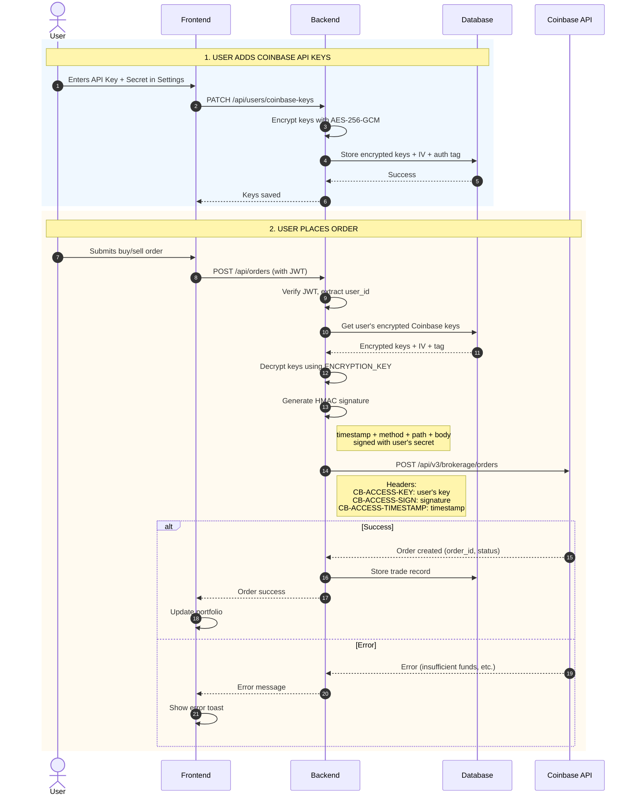
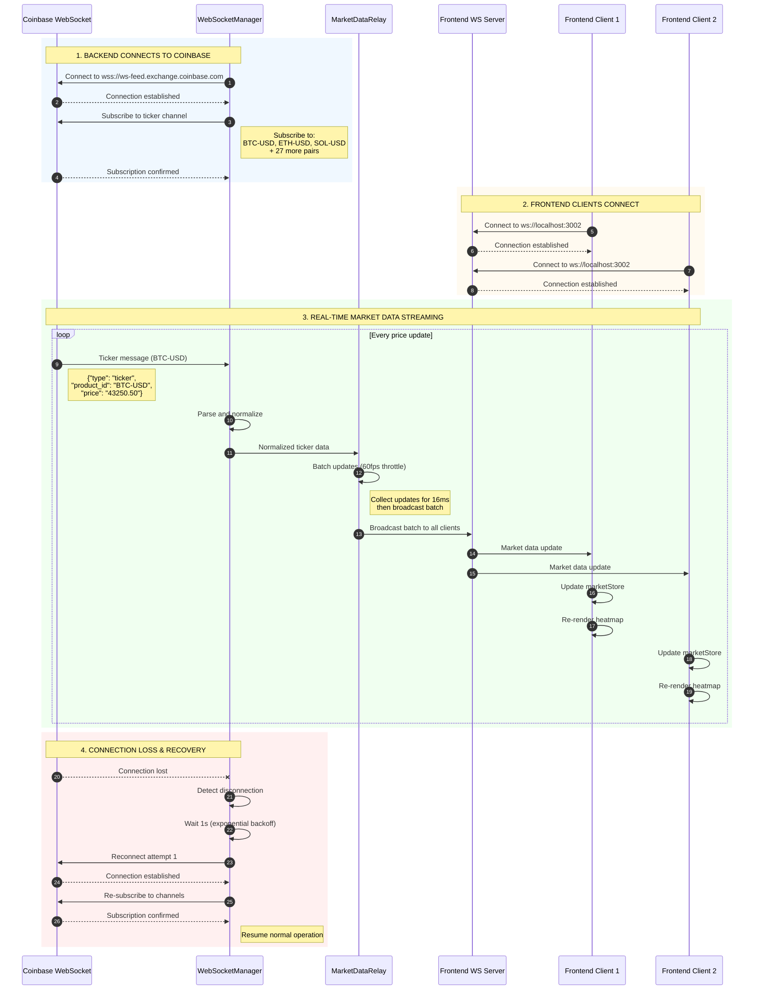

# Coinbase Integration Architecture

## Overview

This document describes how Spectra integrates with Coinbase for real-time market data and trading operations.

## 1. Coinbase REST API Integration

### Authentication Flow (HMAC SHA256)



### HMAC Signature Generation

```typescript
// backend/src/services/CoinbaseClient.ts
private generateSignature(
  timestamp: string,
  method: string,
  path: string,
  body: string
): string {
  const message = `${timestamp}${method}${path}${body}`
  return crypto
    .createHmac('sha256', this.apiSecret) // User's decrypted secret
    .update(message)
    .digest('hex')
}
```

### API Key Storage (Encrypted)

```
Database: spectra_user_t
┌─────────────────────────┬──────────────────────────────────┐
│ user_coinbase_public    │ AES-256-GCM encrypted API key    │
│ user_coinbase_public_iv │ 16-byte initialization vector    │
│ user_coinbase_public_tag│ 16-byte authentication tag       │
│ user_coinbase_secret    │ AES-256-GCM encrypted secret     │
│ user_coinbase_secret_iv │ 16-byte initialization vector    │
│ user_coinbase_secret_tag│ 16-byte authentication tag       │
└─────────────────────────┴──────────────────────────────────┘
```

## 2. Coinbase WebSocket Integration

### Real-Time Market Data Flow



### WebSocket Message Format

**Coinbase Ticker Message (Raw):**
```json
{
  "type": "ticker",
  "sequence": 12345678,
  "product_id": "BTC-USD",
  "price": "43250.50",
  "open_24h": "42800.00",
  "volume_24h": "15234.567",
  "low_24h": "42500.00",
  "high_24h": "43500.00",
  "volume_30d": "450000.123",
  "best_bid": "43250.00",
  "best_ask": "43251.00",
  "side": "buy",
  "time": "2025-11-21T10:30:00.000000Z",
  "trade_id": 987654321,
  "last_size": "0.05"
}
```

**Normalized Message (Sent to Frontend):**
```json
{
  "type": "ticker",
  "productId": "BTC-USD",
  "symbol": "BTC",
  "price": 43250.50,
  "open24h": 42800.00,
  "volume24h": 15234.567,
  "low24h": 42500.00,
  "high24h": 43500.00,
  "change24h": 1.05,
  "change24hPercent": 1.05,
  "bestBid": 43250.00,
  "bestAsk": 43251.00,
  "timestamp": 1700563800000
}
```

### Reconnection Strategy (Exponential Backoff)

```
Attempt 1: Wait 1 second   → Reconnect
Attempt 2: Wait 2 seconds  → Reconnect
Attempt 3: Wait 4 seconds  → Reconnect
Attempt 4: Wait 8 seconds  → Reconnect
Attempt 5: Wait 16 seconds → Reconnect
Attempt 6: Wait 32 seconds → Reconnect
Attempt 7+: Wait 60 seconds (max) → Reconnect

Max attempts: 10
After 10 failed attempts: Notify user, stop trying
```

## 3. Testing Coinbase Connection

### Test 1: Verify API Keys Work

```typescript
// backend/src/services/__tests__/coinbase-connection.test.ts
import { CoinbaseClient } from '../CoinbaseClient'

describe('Coinbase Connection Test', () => {
  it('should authenticate and fetch accounts', async () => {
    const client = new CoinbaseClient(
      process.env.COINBASE_API_KEY!,
      process.env.COINBASE_API_SECRET!
    )
    
    const accounts = await client.getAccounts()
    
    expect(accounts).toBeDefined()
    expect(Array.isArray(accounts)).toBe(true)
    console.log('✅ Coinbase REST API connection successful')
    console.log('Accounts:', accounts)
  })
  
  it('should fetch available products', async () => {
    const client = new CoinbaseClient(
      process.env.COINBASE_API_KEY!,
      process.env.COINBASE_API_SECRET!
    )
    
    const products = await client.getProducts()
    
    expect(products).toBeDefined()
    expect(products.length).toBeGreaterThan(0)
    console.log('✅ Fetched', products.length, 'trading pairs')
  })
})
```

### Test 2: Verify WebSocket Connection

```typescript
// backend/src/services/__tests__/websocket-connection.test.ts
import { WebSocketManager } from '../WebSocketManager'

describe('Coinbase WebSocket Test', () => {
  it('should connect and receive ticker messages', (done) => {
    const wsManager = new WebSocketManager()
    
    wsManager.onMessage((message) => {
      console.log('✅ Received message:', message)
      expect(message.type).toBe('ticker')
      expect(message.productId).toBeDefined()
      expect(message.price).toBeGreaterThan(0)
      
      wsManager.disconnect()
      done()
    })
    
    wsManager.connect().then(() => {
      console.log('✅ WebSocket connected')
      wsManager.subscribe(['BTC-USD', 'ETH-USD'])
    })
  }, 10000) // 10 second timeout
})
```

### Test 3: End-to-End Connection Test

```bash
# Run this script to test full connection
cd backend
npm test -- coinbase-connection.test.ts --run
```

**Expected Output:**
```
✅ Coinbase REST API connection successful
Accounts: [
  { id: '...', currency: 'USD', balance: '1000.00' },
  { id: '...', currency: 'BTC', balance: '0.05' }
]
✅ Fetched 150 trading pairs
✅ WebSocket connected
✅ Received message: { type: 'ticker', productId: 'BTC-USD', price: 43250.50 }
```

## 4. Connection Status Indicator

### Frontend Implementation

```typescript
// frontend/src/components/layout/ConnectionStatus.tsx
import { useWebSocket } from '@/hooks/useWebSocket'

export function ConnectionStatus() {
  const { status } = useWebSocket()
  
  const statusConfig = {
    connected: {
      color: 'bg-green-500',
      text: 'Connected',
      icon: '●'
    },
    connecting: {
      color: 'bg-yellow-500',
      text: 'Connecting...',
      icon: '◐'
    },
    disconnected: {
      color: 'bg-red-500',
      text: 'Disconnected',
      icon: '○'
    }
  }
  
  const config = statusConfig[status]
  
  return (
    <div className="flex items-center gap-2">
      <span className={`w-2 h-2 rounded-full ${config.color}`} />
      <span className="text-sm text-gray-600 dark:text-gray-400">
        {config.text}
      </span>
    </div>
  )
}
```

## 5. Your API Key Format (ECDSA)

Your `cdp_api_key.json` uses **ECDSA** signature algorithm, which is different from the HMAC SHA256 implementation in the current code.

### Current Implementation (HMAC SHA256):
```typescript
crypto.createHmac('sha256', secret).update(message).digest('hex')
```

### Your Key Requires (ECDSA):
```typescript
import { createSign } from 'crypto'

function generateECDSASignature(message: string, privateKey: string): string {
  const sign = createSign('SHA256')
  sign.update(message)
  sign.end()
  return sign.sign(privateKey, 'hex')
}
```

### ⚠️ ACTION REQUIRED

You need to update `CoinbaseClient.ts` to support ECDSA signatures:

```typescript
// backend/src/services/CoinbaseClient.ts
private generateSignature(
  timestamp: string,
  method: string,
  path: string,
  body: string
): string {
  const message = `${timestamp}${method}${path}${body}`
  
  // Check if using ECDSA (EC PRIVATE KEY format)
  if (this.apiSecret.includes('BEGIN EC PRIVATE KEY')) {
    const sign = crypto.createSign('SHA256')
    sign.update(message)
    sign.end()
    return sign.sign(this.apiSecret, 'hex')
  }
  
  // Otherwise use HMAC SHA256
  return crypto
    .createHmac('sha256', this.apiSecret)
    .update(message)
    .digest('hex')
}
```

## Next Steps

1. **Update CoinbaseClient** to support ECDSA signatures
2. **Test connection** with your API keys
3. **Implement Task 3.1** - Backend WebSocket server for frontend
4. **Implement Task 3.2** - Market data relay
5. **Implement Task 7.2** - Order placement with user keys
