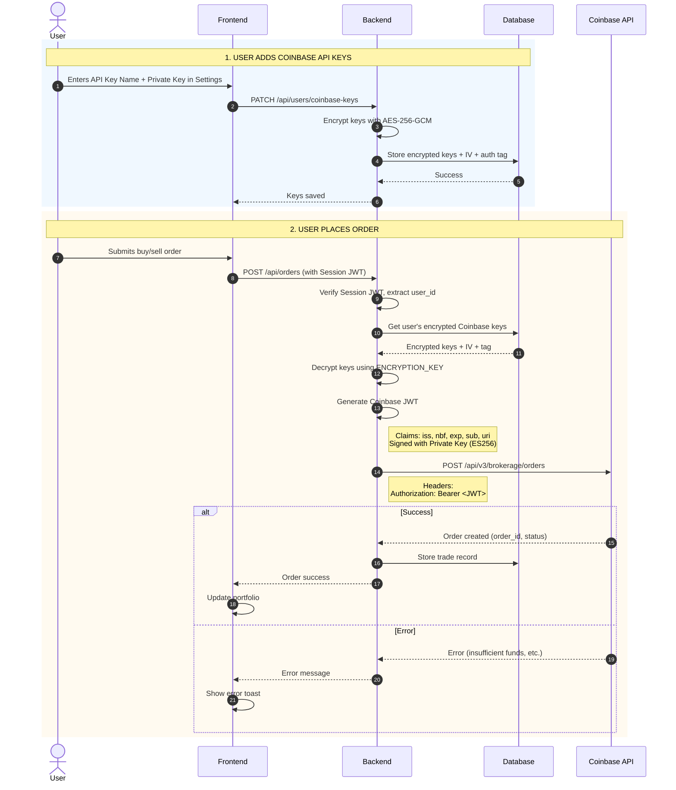
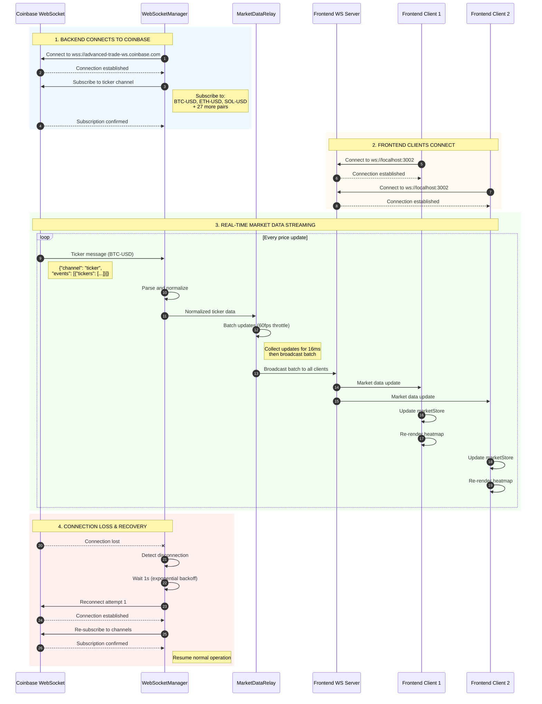

# Coinbase Integration Architecture

## Overview

This document describes how Spectra integrates with Coinbase for real-time market data and trading operations.
We use the **Coinbase Advanced Trading API** with **CDP API Keys** which require **JWT (JSON Web Token)** authentication signed with **ES256**.

## 1. Coinbase REST API Integration

### Authentication Flow (JWT / ES256)



### JWT Generation Logic

We use the `jsonwebtoken` library to generate ES256 signed tokens.

```typescript
// backend/src/services/CoinbaseAdvancedClient.ts

private generateJWT(requestMethod: string, requestPath: string): string {
  // URI claim format: "METHOD host path" (no protocol)
  const uri = `${requestMethod} api.coinbase.com${requestPath}`

  return jwt.sign(
    {
      iss: 'coinbase-cloud',
      nbf: Math.floor(Date.now() / 1000),
      exp: Math.floor(Date.now() / 1000) + 120, // 2 min expiration
      sub: this.apiKeyName, // API Key Name (e.g. organizations/...)
      uri,
    },
    this.privateKey,
    {
      algorithm: 'ES256',
      header: {
        kid: this.apiKeyName, // Key ID is also the API Key Name
        nonce: crypto.randomBytes(16).toString('hex'),
      }
    }
  )
}
```

### API Key Storage (Encrypted)

Keys are stored encrypted in the `spectra_user_t` table.

```
Database: spectra_user_t
┌─────────────────────────┬──────────────────────────────────┐
│ user_coinbase_public    │ Encrypted API Key Name           │
│ user_coinbase_public_iv │ 16-byte initialization vector    │
│ user_coinbase_public_tag│ 16-byte authentication tag       │
│ user_coinbase_secret    │ Encrypted Private Key (PEM)      │
│ user_coinbase_secret_iv │ 16-byte initialization vector    │
│ user_coinbase_secret_tag│ 16-byte authentication tag       │
└─────────────────────────┴──────────────────────────────────┘
```

## 2. Coinbase WebSocket Integration

### Real-Time Market Data Flow



### WebSocket Message Format

**Coinbase Ticker Message (Advanced Trade):**
```json
{
  "channel": "ticker",
  "client_id": "",
  "timestamp": "2023-10-25T19:41:19.655Z",
  "sequence_num": 0,
  "events": [
    {
      "type": "snapshot",
      "tickers": [
        {
          "type": "ticker",
          "product_id": "BTC-USD",
          "price": "34567.89",
          "volume_24_h": "12345.67",
          "low_24_h": "34000.00",
          "high_24_h": "35000.00",
          "low_52_w": "15000.00",
          "high_52_w": "35000.00",
          "price_percent_chg_24_h": "1.23"
        }
      ]
    }
  ]
}
```

**Normalized Message (Sent to Frontend):**
```json
{
  "type": "ticker",
  "productId": "BTC-USD",
  "symbol": "BTC",
  "price": 34567.89,
  "open24h": 34147.89, // Calculated from change %
  "volume24h": 12345.67,
  "low24h": 34000.00,
  "high24h": 35000.00,
  "change24h": 420.00,
  "change24hPercent": 1.23,
  "timestamp": 1698262879655
}
```

## 3. Testing Coinbase Connection

### Test 1: Verify API Keys Work

```typescript
// backend/tests/api/coinbase-connection.test.ts
import { CoinbaseAdvancedClient } from '../../src/services/CoinbaseAdvancedClient'

describe('Coinbase Connection Test', () => {
  it('should authenticate and fetch accounts', async () => {
    const client = new CoinbaseAdvancedClient(
      process.env.COINBASE_API_KEY_NAME!,
      process.env.COINBASE_PRIVATE_KEY!
    )
    
    const accounts = await client.getAccounts()
    
    expect(accounts).toBeDefined()
    expect(Array.isArray(accounts)).toBe(true)
    console.log('✅ Coinbase Advanced API connection successful')
  })
})
```

## 4. Connection Status Indicator

### Frontend Implementation

```typescript
// frontend/src/components/layout/ConnectionStatus.tsx
import { useWebSocket } from '@/hooks/useWebSocket'

export function ConnectionStatus() {
  const { status } = useWebSocket()
  
  const statusConfig = {
    connected: {
      color: 'bg-green-500',
      text: 'Connected',
      icon: '●'
    },
    connecting: {
      color: 'bg-yellow-500',
      text: 'Connecting...',
      icon: '◐'
    },
    disconnected: {
      color: 'bg-red-500',
      text: 'Disconnected',
      icon: '○'
    }
  }
  
  const config = statusConfig[status]
  
  return (
    <div className="flex items-center gap-2">
      <span className={`w-2 h-2 rounded-full ${config.color}`} />
      <span className="text-sm text-gray-600 dark:text-gray-400">
        {config.text}
      </span>
    </div>
  )
}
```
