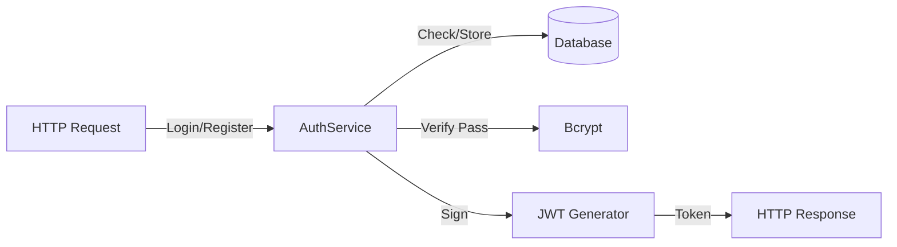
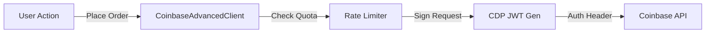
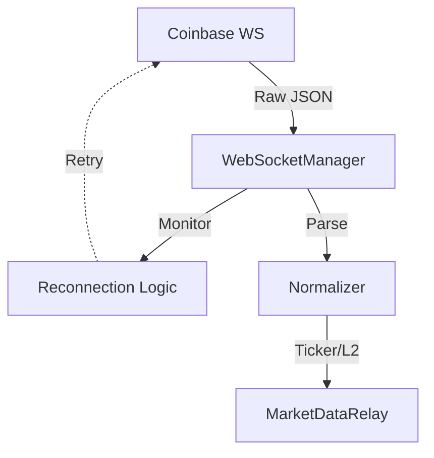
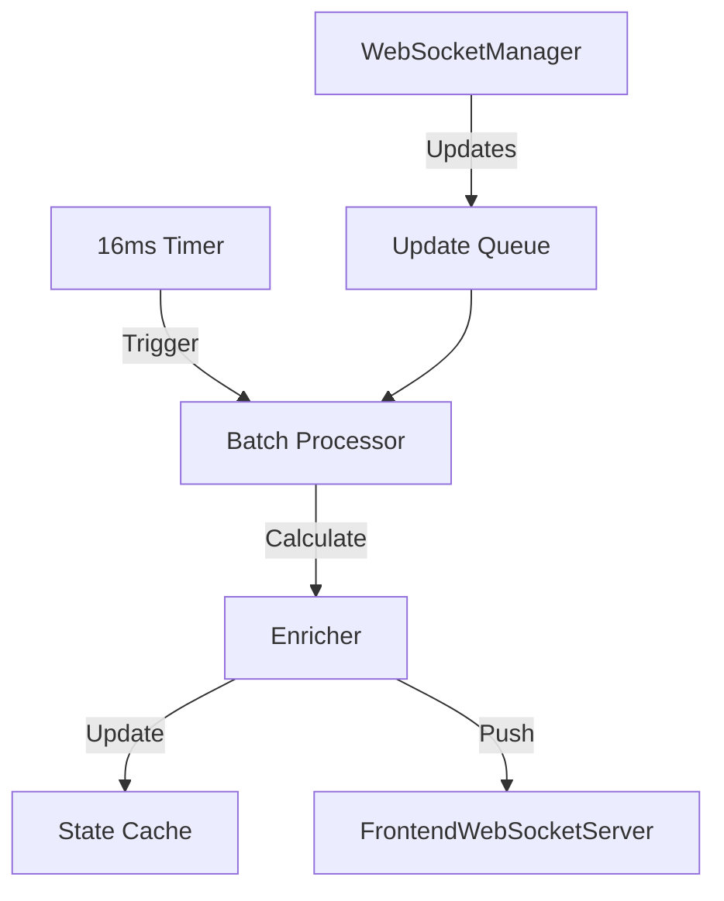
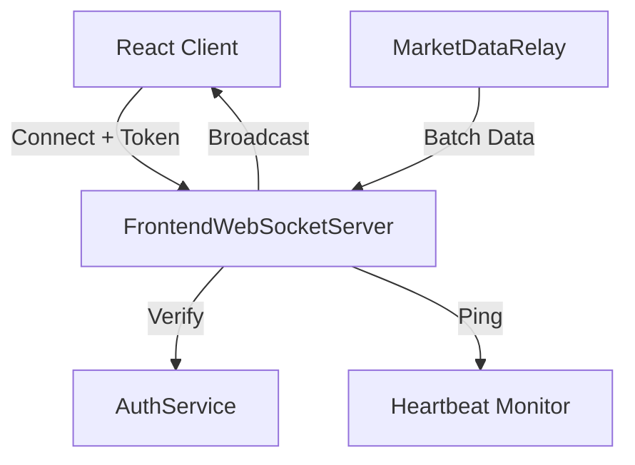
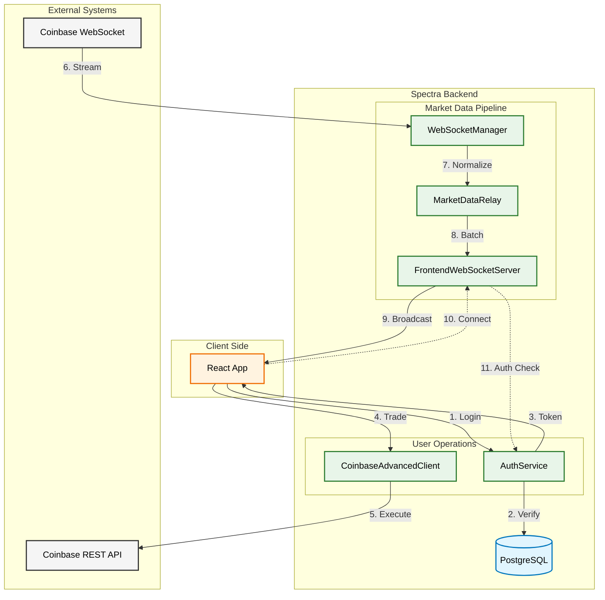

# Spectra Backend Services Architecture

This document provides a comprehensive overview of the Spectra backend architecture, detailing the responsibilities of each service, their interactions, and the data flow that powers the real-time crypto trading platform.

## System Overview

The Spectra backend is designed as a modular, event-driven system. It bridges the gap between the high-frequency, public market data from Coinbase and the private, user-specific trading operations of the Spectra frontend.

The core components are:

1.  **AuthService**: Identity and Access Management.
2.  **CoinbaseAdvancedClient**: Execution and Account Management (REST).
3.  **WebSocketManager**: Real-time Market Data Ingestion (Coinbase WS).
4.  **MarketDataRelay**: Data Processing, Batching, and State Management.
5.  **FrontendWebSocketServer**: Real-time Client Communication (Spectra WS).

## Service Descriptions

### 1. AuthService (`AuthService.ts`)
**Role**: The Gatekeeper
**Responsibilities**:
-   **Smart Login**: Authenticates users via either email address or username.
-   **Security**: Hashes passwords using `bcrypt` with salt rounds.
-   **Session Management**: Issues JWTs (JSON Web Tokens) for API access and WebSocket authentication.
-   **User Management**: Handles registration and profile retrieval, including checking for Coinbase API key configuration.

**Key Interactions**:
-   **Database**: Reads/Writes user data to `spectra_user_t`.
-   **Frontend**: Receives login/register requests via HTTP endpoints.

### 2. CoinbaseAdvancedClient (`CoinbaseAdvancedClient.ts`)
**Role**: The Broker
**Responsibilities**:
-   **CDP Authentication**: Generates short-lived, request-specific JWTs signed with the user's private key (ES256 algorithm) for Coinbase Cloud API access.
-   **Rate Limiting**: Implements a token bucket or window-based rate limiter (max 30 requests/minute) to prevent API bans.
-   **Resilience**: Retries failed requests with exponential backoff (excluding 401/403 errors).
-   **Operations**:
    -   Fetches account balances.
    -   Retrieves product (trading pair) information.
    -   Executes and manages orders (Market/Limit).

**Key Interactions**:
-   **Coinbase API**: Sends authenticated REST requests.
-   **Frontend**: Triggered by user actions (e.g., "Buy Bitcoin").

### 3. WebSocketManager (`WebSocketManager.ts`)
**Role**: The Listener
**Responsibilities**:
-   **Connection Management**: Maintains a persistent WebSocket connection to `wss://ws-feed.exchange.coinbase.com`.
-   **Auto-Reconnection**: Implements robust reconnection logic with exponential backoff (1s to 60s) if the link is severed.
-   **Subscription Management**: Handles subscribing/unsubscribing to `ticker` and `level2` channels for top cryptocurrencies.
-   **Normalization**: Transforms raw Coinbase JSON messages into standardized internal TypeScript interfaces (`TickerMessage`, `Level2Message`).

**Key Interactions**:
-   **Coinbase WebSocket Feed**: Receives raw market data.
-   **MarketDataRelay**: Pushes normalized data for processing via callbacks.

### 4. MarketDataRelay (`MarketDataRelay.ts`)
**Role**: The Processor & Distributor
**Responsibilities**:
-   **Aggregation**: Collects high-frequency updates from `WebSocketManager`.
-   **Batching**: Groups updates into 16ms windows (approx. 60fps) to prevent frontend flooding.
-   **Enrichment**:
    -   Calculates 24h change percentage.
    -   Estimates Market Cap based on static supply data.
    -   Formats timestamps.
-   **State Caching**: Maintains a `latestTickerState` map to serve new clients immediately upon connection.
-   **Broadcasting**: Pushes `ticker_batch` messages to `FrontendWebSocketServer`.

**Key Interactions**:
-   **WebSocketManager**: Source of raw data.
-   **FrontendWebSocketServer**: Destination for processed data.

### 5. FrontendWebSocketServer (`FrontendWebSocketServer.ts`)
**Role**: The Broadcaster
**Responsibilities**:
-   **Connection Handling**: Accepts WebSocket connections on port 3002.
-   **Authentication**: Verifies JWT tokens passed via query parameters (`?token=...`) or headers.
-   **Heartbeat**: Runs a 30-second ping/pong cycle to detect and terminate stale connections (`isAlive` check).
-   **Client Management**: Tracks connected users and their active sockets.
-   **Routing**: Supports broadcasting to all clients or targeting specific users.

**Key Interactions**:
-   **Frontend (React)**: Maintains persistent connections with user browsers.
-   **MarketDataRelay**: Receives data to broadcast.

---

## Integrated Architecture Diagram

The following diagram illustrates the complete data flow, from external exchanges to the user interface.

## Data Flow Scenarios

### Scenario A: Real-time Price Updates
1.  **Coinbase** pushes a price update for `BTC-USD` via WebSocket.
2.  **WebSocketManager** receives the message, normalizes the field names (e.g., `product_id` -> `productId`), and passes it to **MarketDataRelay**.
3.  **MarketDataRelay** adds the update to its internal queue.
4.  Every 16ms (tick), **MarketDataRelay**:
    *   Processes the queue.
    *   Calculates derived metrics (Change %, Market Cap).
    *   Updates its internal `latestTickerState` cache.
    *   Creates a `ticker_batch` message containing all updates in this window.
5.  **MarketDataRelay** calls `broadcast()` on **FrontendWebSocketServer**.
6.  **FrontendWebSocketServer** iterates through all authenticated clients and sends the JSON message.
7.  **React App** receives the message, parses it, and updates the global `marketStore`.

### Scenario B: User Connects to Dashboard
1.  **React App** initiates a WebSocket connection to `ws://localhost:3002?token=...` using the token stored in `localStorage`.
2.  **FrontendWebSocketServer** validates the token signature.
3.  If valid, the connection is accepted, and the client is added to the `clients` map.
4.  **MarketDataRelay** detects the new connection via a registered callback.
5.  **MarketDataRelay** immediately retrieves the cached `latestTickerState` for all tracked coins.
6.  **MarketDataRelay** sends a `ticker_batch` with this initial state to the *specific* new client.
7.  **React App** renders the dashboard with data instantly, without waiting for the next live tick from Coinbase.

### Scenario C: Resilience & Recovery
*   **Coinbase Disconnect**: If `WebSocketManager` loses connection to Coinbase, it enters a `reconnecting` state. It attempts to reconnect with exponential backoff (1s, 2s, 4s...). Once reconnected, it automatically resubscribes to all channels.
*   **Frontend Disconnect**: If a user's internet drops, `FrontendWebSocketServer` misses the heartbeat (ping). After the timeout, the server terminates the connection to free resources. The frontend `useWebSocket` hook will also detect the loss and attempt to reconnect.
