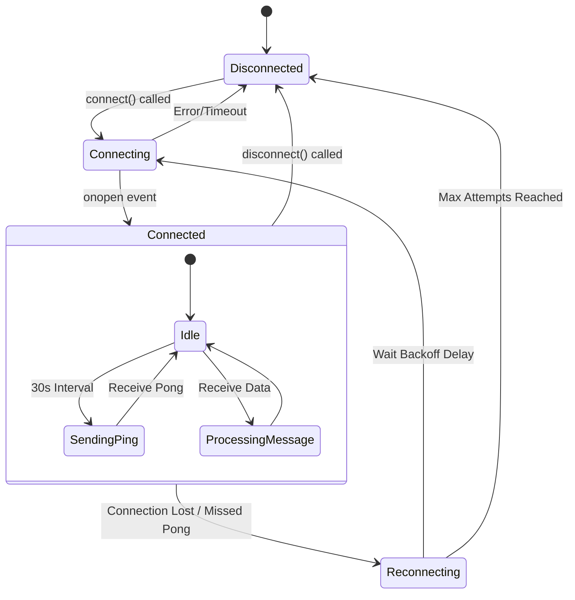
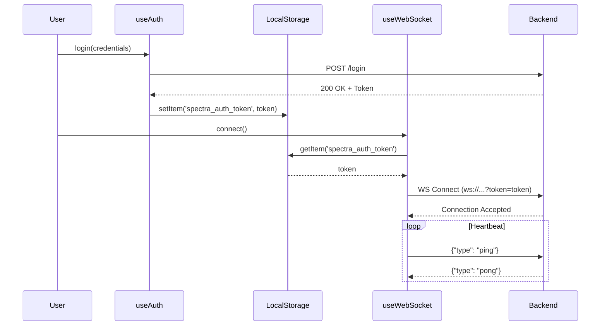

# Frontend Hooks Documentation

This document details the implementation and usage of the custom React hooks used in the Spectra frontend application.

## 1. useAuth Hook

The `useAuth` hook provides a convenient interface for accessing the authentication context. It manages the user's session, login/registration state, and token storage.

### Key Responsibilities
-   **Global State**: Exposes `user`, `token`, `isLoading`, and `error` states.
-   **Session Management**: Handles cookie-based sessions (via `axios` with `withCredentials`) for API requests.
-   **Token Persistence**: Synchronizes the JWT token to `localStorage` specifically for WebSocket authentication (since WebSockets don't automatically send cookies in the same way as XHR/Fetch in all environments, or for explicit token passing).
-   **Actions**: Provides methods for `login`, `register`, `logout`, and `refreshUser`.

### Architecture

```mermaid
graph TD
    subgraph Components
        LoginView[Login Component]
        Protect[ProtectedRoute]
    end

    subgraph Hooks
        useAuth[useAuth Hook]
    end

    subgraph Context
        AuthCtx[AuthContext]
    end

    subgraph External
        API[Backend API]
        Storage[LocalStorage]
    end

    LoginView -->|Call login()| useAuth
    useAuth -->|Access| AuthCtx
    AuthCtx -->|POST /api/auth/login| API
    API --|Set-Cookie + JSON Token| AuthCtx
    AuthCtx --|Update State| AuthCtx
    AuthCtx --|Save Token| Storage
    Protect -->|Check user state| useAuth
```

### Usage Example

```typescript
const { login, user, isLoading, error } = useAuth();

const handleLogin = async (credentials) => {
  try {
    await login(credentials);
    // Redirect or update UI
  } catch (err) {
    console.error("Login failed", err);
  }
};
```

---

## 2. useWebSocket Hook

The `useWebSocket` hook manages the persistent real-time connection to the Spectra backend. It handles the complexities of connection lifecycle, resilience, and data dispatching.

### Key Responsibilities
-   **Connection Lifecycle**: Manages `connecting`, `connected`, `disconnected`, and `reconnecting` states.
-   **Resilience**: Implements exponential backoff for reconnection attempts (up to 5 attempts).
-   **Heartbeat**: Sends `ping` messages every 30 seconds and expects `pong` responses to detect stale connections.
-   **Data Dispatching**:
    -   Automatically handles `ticker_batch` messages to update the global `marketStore`.
    -   Allows components to subscribe to specific message types via `onMessage`.

### Connection Lifecycle Diagram



### Usage Example

```typescript
const { status, connect, onMessage } = useWebSocket();

// Connect on mount
useEffect(() => {
  connect();
}, [connect]);

// Listen for specific events
useEffect(() => {
  const unsubscribe = onMessage('order_update', (data) => {
    console.log('Order updated:', data);
  });
  return unsubscribe;
}, [onMessage]);
```

---

## 3. Integrated Workflow

The `useAuth` and `useWebSocket` hooks work together to ensure secure, real-time data delivery. The critical integration point is the **JWT Token**.

### Interaction Flow

1.  **Login**: User logs in via `useAuth`. The backend returns a JWT.
2.  **Storage**: `AuthContext` saves this JWT to `localStorage` key `spectra_auth_token`.
3.  **Connection**: `useWebSocket` reads `spectra_auth_token` from `localStorage`.
4.  **Handshake**: The WebSocket connection is initialized with `?token=<jwt>`.
5.  **Validation**: The backend validates the token before accepting the connection.


